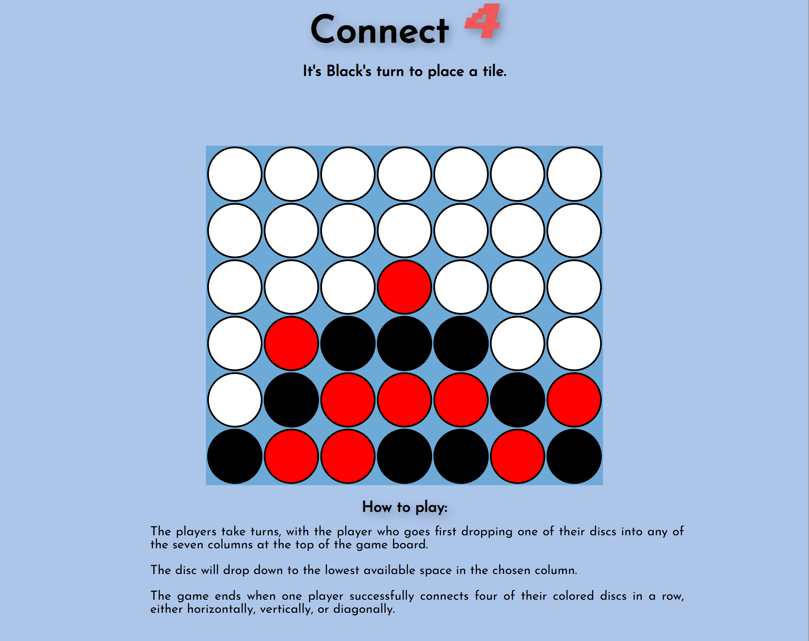

# 🎮 Connect 4 Web Game

> **A retro and interactive Connect 4 game built with HTML, CSS, and JavaScript.**

---

<!-- Connect4 Banner -->
<p align="center">
  
</p>

---

<p align="center">
  
  
  
  
</p>

---

## 📑 Table of Contents

1. [Introduction](#-introduction)
2. [Tech Stack](#-tech-stack)
3. [Features](#-features)
4. [Quick Start](#-quick-start)
5. [Screenshots](#-screenshots)
6. [Deployment](#-deployment)
7. [About](#-about)

---

## 🚀 Introduction

Connect 4 is a timeless two-player strategy game. This web version is designed to be visually appealing and easy to play on your browser. Built as a portfolio project to demonstrate frontend skills, clean code, and user-focused design. (Also my first javascript project)

---

## 🛠️ Tech Stack

- **HTML5** – Semantic markup for structure
- **CSS3** – Custom styles and animations
- **JavaScript** – Game logic and DOM manipulation

---

## ✨ Features

- 🎨 **Retro UI:** Clean, colourful, and accessible
- 🖱️ **Interactive:** Play with mouse or keyboard
- 🏆 **Win Detection:** Horizontal, vertical, and diagonal
- 🔄 **Instant Restart:** Play again with one click
- 🧩 **No Dependencies:** Just open and play

---

## 👌 Quick Start

1. **Clone the repository:**
   ```bash
   git clone https://github.com/Mikepin23/Connect4.git
   cd Connect4
   ```
2. **Open `index.html` in your browser.**

---

## 💻 Try It Yourself

This project is live and playable:

[🌐 Demo Now](https://connect4-yotu.onrender.com/)

---

## 👤 About

Created by **Michael Pinsonneault**

- [Portfolio](https://portfolio-michael-pinsonneault.onrender.com)
- [GitHub](https://github.com/Mikepin23)
- [LinkedIn](https://www.linkedin.com/in/michael-pinsonneault)

> Thank you for checking out my project!
